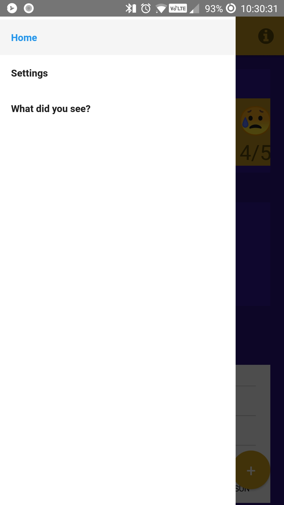
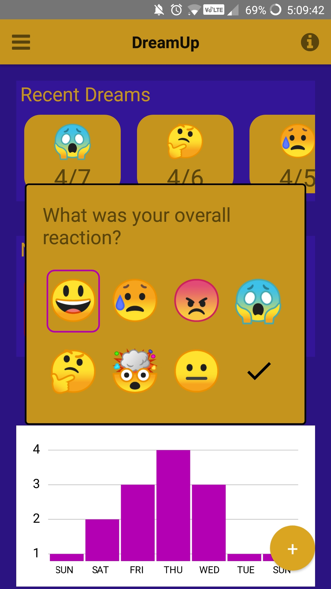
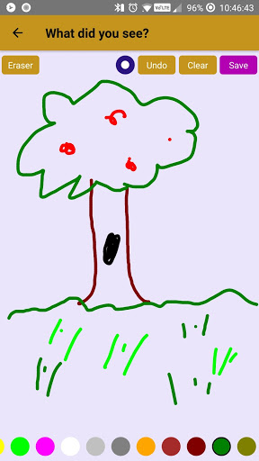
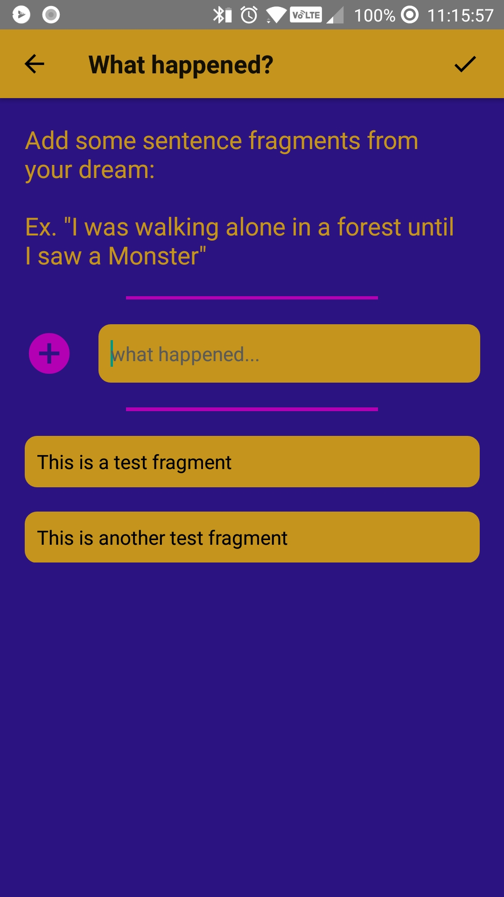
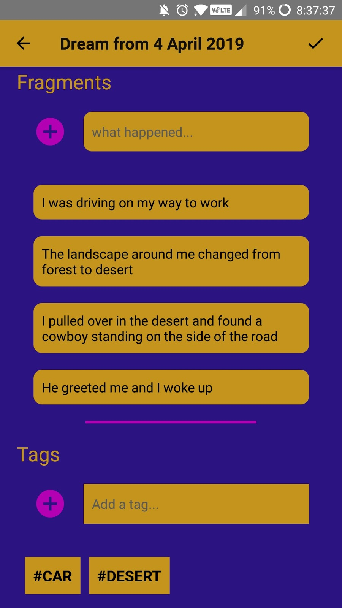
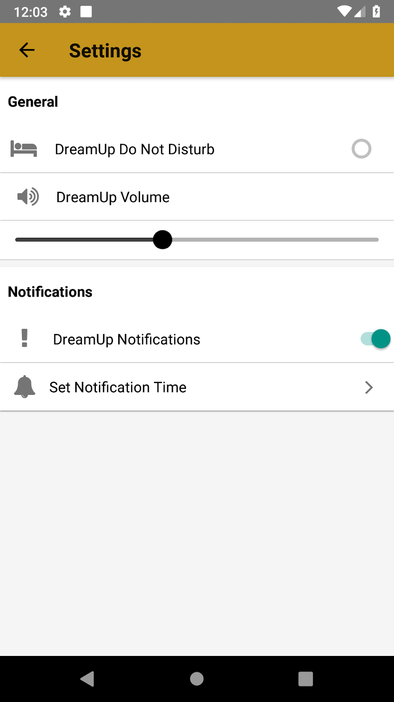
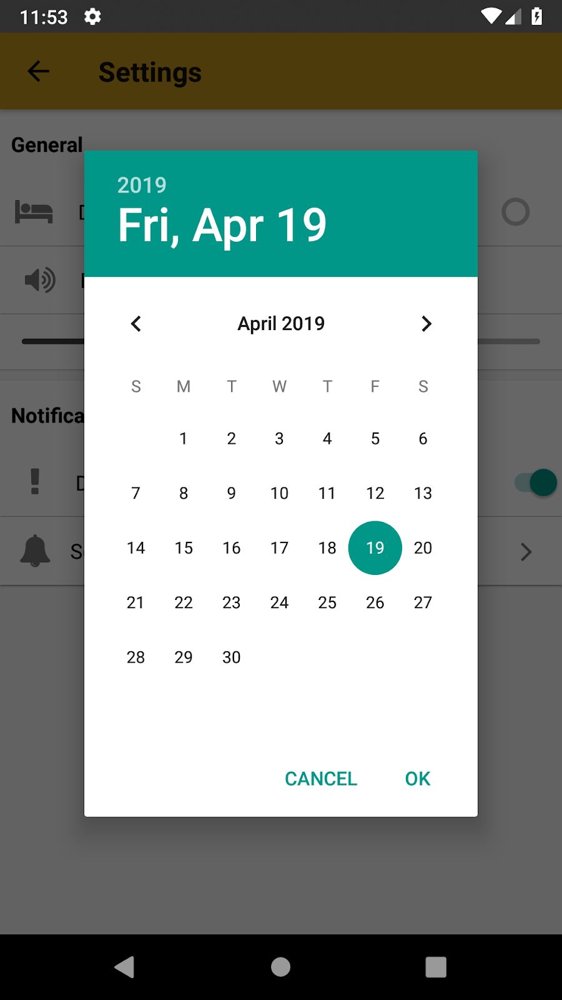
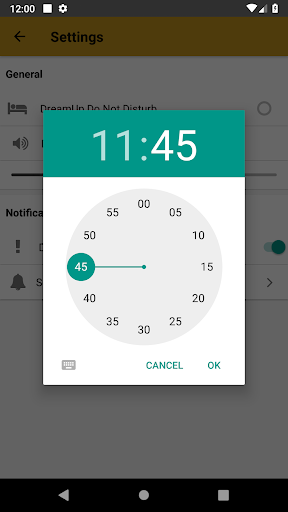

# DreamUp

### What is DreamUp?

DreamUp is an android app that allows people to easily record their dreams. Since dreams are weird and can be non-linear and visual, the app allows its users to describe dreams with both words and pictures. Each dream that you enter is broken up into various parts:

* The *reaction* is an emoji that sums up the overall feeling that the user associates with the dream.
* The *drawing* is a touch canvas drawing the the user creates.
* A set of *fragments* describes different parts of the dream that the app user can recall.
* *Tags* are added to quickly lookup dreams with related content.
* A *description* allows the user to give a longer description of the dream if they want to.

Users can also set up a repeating notification to remind them to enter info for a dream right when they get up.

### Screens

#### Dream Dashboard
On the Dream Dashboard you can see a brief overview of recent dreams. Both *Recent Dreams* and *Nightmares* sections are scrollable and will go back as far as you want. On the bottom of the dashboard is a small graph that tracks the number of fragments for each dream on a weekly basis. This graph is live so the graph will update based on the day of the week and with new dreams added.

Tapping on the hamburger icon on the top left will bring up a small sidebar with navigation to a list of settings or a way to enter a dream without a reaction.

Tapping on the floating action button in the bottom right will begin the process of adding a new dream.

Tapping on any of the dream squares will navigate to the page for that specific dream which can be edited later if the user wants.

### Adding a new dream

In order to keep the process of entering a dream quick and simple there are only 3 steps required:
1. A *reaction* is selected from the Dream Dashboard as shown in the last section.
2. The user creates a *drawing* in the canvas to represent the dream.
3. The user enters at least one *fragment* from their dream. Fragments can also be removed and rearranged

At this point the user is at the Dream Detail page. This page serves as a summary of all the info about the dream they've just entered. There's two additional fields here: tags, and description that can be set by the user if they want to edit the Dream. At any point in this process the user can hit the back arrow in the top left to return to the previous step.

### Settings/Notifications

In the settings menu notifications can be set and managed. To set a notification the user must choose set notification start date and repeating time. Once set the notification will show up at the same time on a daily unless *DreamUp Do Not Disturb* is turned on or notifications are turned off.

### Behind the Scenes
This app was created using react-native, and a few packages from npm. The information associated with each dream was stored in a local mongoDB collection. Each drawing created within the app is stored locally in a "Dreams" folder on the users phone in case they want to export the images somewhere else. To save space no other backups are made so if the user's drawing get deleted or moved the app will show a missing icon when they select the dream. Firebase was also used to manage the notifications to avoid having separate native code.

This app is composed of various small react components that were designed to be independent and reusable. The stylized text input fields, buttons, popups, and dividers are examples of code reuse.